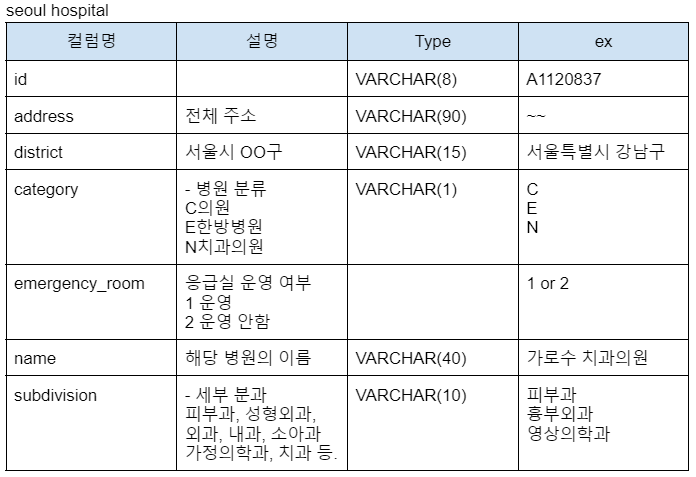

# java와 DB연동(Dao)
### UserDao.java
- get() - SELECT FROM 쿼리문
- add() - INSERT INTO 쿼리문
### User.java
- id, name, password 등 User 정보를 저장하는 클래스
 

# 병원 정보 Parsing
- 서울특별시 병의원.csv 파일을 분석 -> File(데이터)에서 필요한 정보 parsing
  - 병원분류명이 총 몇가지 인지? 
  -  병원분류별로 몇개씩 있는지? 
  - 병원 분류가 몇가지 인지?
  - 서울의 구별로 각 병원이 몇개 있는지 ex) 서울시 금천구 의원, 한방병원, 치과병원, .. 이 각 몇개인지?
  - 구별로 병원이 가장 많은 구는?
  - 이비인후과(0), 외과(1), 내과(2), 소아과(3), 피부과, 성형외과 는 각 몇개인지(category)

 

